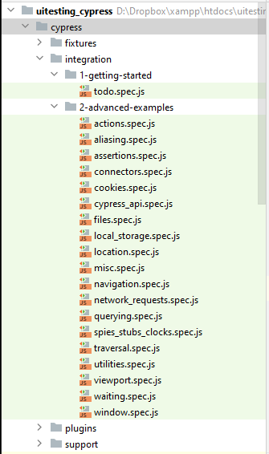

# UI-Testing mit Cypress

## Was ist Cypress?

- Framework für das Testing von Web-Anwendungen
- Open-Source
- Ähnlich wie Selenium
- Meiner Meinung nach deutlich besser, einfacher und flexibler

## Installation

```
npm install cypress
```



```
cypress open
```

## Repository

[https://gitlab.com/fh-swf/fb-in/moderne_web-frameworks/uitesting_cypress](https://gitlab.com/fh-swf/fb-in/moderne_web-frameworks/uitesting_cypress)
